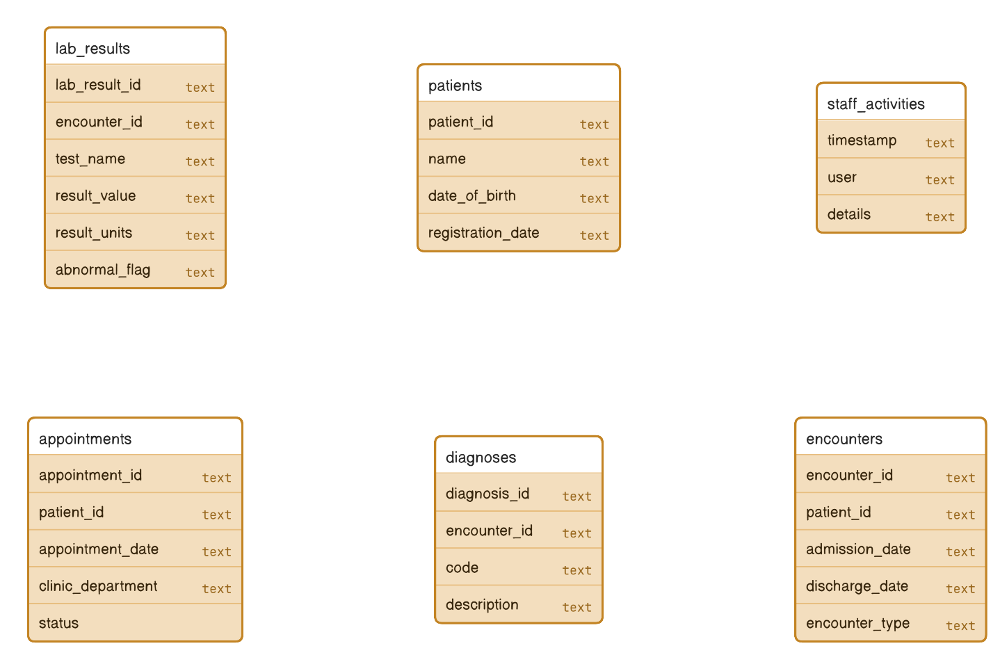
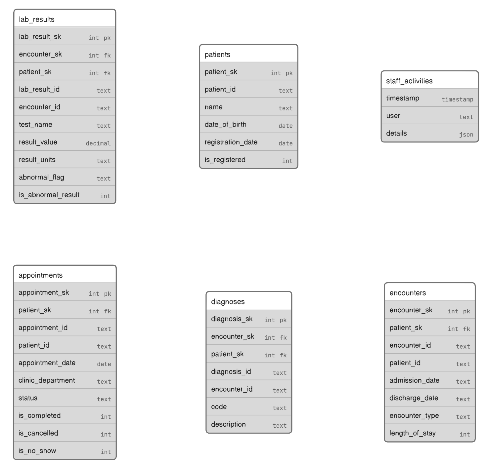
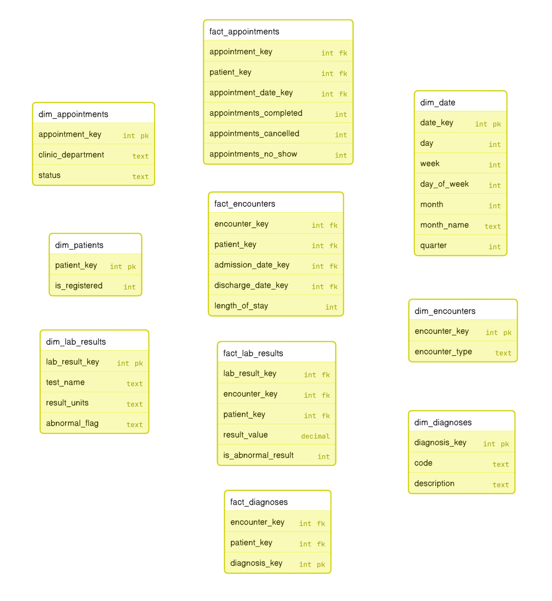

## Overview
This repos contains my response to the [take-home task](Instructions.md) provided by Heidi Health.

## How to run

#### With Github Action

Go to Github Actions, trigger the **Deliverables** (task-runner.yml) workflow. The workflow would run the the following steps:

  1. Load data from SQL scripts and files into a SQLite file
  2. Calculate 4 existing metrics and display results
  3. Calculate 2 additional metrics and display results

Each step would execute a series of SQL scripts. The scrips will be printed to the console before executing. Step 2 and 3 will also print the metric results to the console log. At the end of the workflow, the SQlite file is uploaded as an artifact **hello-heidi**. The file could be downloaded and viewed with tools like [SQLite Viewer](https://inloop.github.io/sqlite-viewer/).

#### From Local Machine
System Requirements:
   - `Ubunto-22.04`
   - `Python 3.10.12`

In a compatible system, clone the repo and run the following scripts in order:
   - `1_load_data.py`
   - `2_calculate_existing_metrics.py`
   - `3_calculate_additional_metrics.py`

As in Github Actions, each step would print the SQL scripts before executing, and in Step 2 and 3, the metric results as well. The SQlite file will be created in the root folder of the repo and could be viewed with tools like [SQLite Viewer](https://inloop.github.io/sqlite-viewer/).

## Discussions

### Data Load

- The scripts to load the SQL data each contain 2 main components:
   - A `CREATE` statement to create the table structure.
   - An `INSERT` statement with embedded data to populate the table.

- The each of the `csv`, `json` and `log` file is process with following steps:
   - Parse the content of the file to a list of python dictionary objects.
   - Constructe a `CREATE TABLE AS` (CTAS) SQL script from the the python dictionary list.
   - Run the CTAS SQL script to initialize the table with data upon creation.

- All the SQL scripts above have a `DROP IF EXIST` statement at the start to make it easier to rerun the data load process without having to delete the SQLite file everytime.

### Data Transformation

- Usually, a data analytics system is multi-layered. A most common architecture would be the medallion system: 
  - 🥉 **Bronze** (raw/landing/ingest) layer where data are stored in rudimentary data types with **little to no modification**.
  - 🥈 **Silver** (staging/integration) layer where data are **combined, quality-checked, enriched, standardized, business rules implemented**.
  - 🥇 **Gold** (model/presentation) layer where metrics are created, and models like the **Kimball Star Schema** or **OBT (One-Big-Table)** are built.

- The data load process so far mostly fit into the development of the Bronze layer. Hence, the following decisions are made:
   - Despite seeing some implied foreign key relationships, the tables/files are individually loaded as they were using the most compatible data type possible with no joining or modifying.
   - The foreign key constraints do not need to be expressedly created in the database. They just need to be documented and utilised properly in queries.
   - The orphan records (e.g. `patient_id`=`P999` in `encounters` and `encounter_id`=`E999` in `lab_results`) do not need to be resolved in this layer. An additional data quality metrics has been created to identify them. In the development of theb Silver layer, a dummy record will be created in the corresponding parent table for each orphan foreign key value so those orphan records can be included in the data models and queries. Decisions to include or exclude them can be made later in analyses based on specific use case.

- The event payload in `staff_activity.log` looks like a series of context specific key-value-pairs that would change based on event types. Though it's possible to exhaustively extract each possible key into a separate column, this would result in very unstable table structure and create a lot `NULL` values in the table. Hence a decision is made to stored them together as `JSON` text in one single column. When this data is loaded into the Silver or Gold Layers, most RDBMS would have built-in functions to parse this `JSON` text and extract child values. Or better yet, some systems like Google Big Query can save them directly as `STRUCT` and handle them gracefully.

### Calculate Metrics
- Usually, metrics are created in the Silver or Gold Layer and used in combination with other numerical or categorical data items in reports and dashboards. However, for simplicity's sake, all metrics here are directy calculated with a query on the source table. Due to the simplicity of the business rules, no table joining were required to produce the results.
- For non-additive metrics like rate or percentages, the SQL query would only handle the counting of numerators and denominators based on the business rules. The final division and rounding is handled in Python. This is to mimic the real world scenario where the physical table would only store additive measures while letting the in-memory BI tool handle the division and display format.

### Data Model

#### 🥉 Bronze Layer

After loading the tables as per the instructions, the Bronze Layer schema would look like this;

#### 🥈 Silver Layer

When loading data into the Silver Layer, the following tasks would be carried out:
- Tables for the same entity will be merged and combined and deduplicated (e.g multiple `patients` tables from multiple different systems).
- Create surrogate keys (e.g. `patient_sk`) for each entity.
- Look up all the surrogate keys directly or indirectly related to the table (e.g. for `lab_results`, look up both `patient_sk` and `encounter_sk`).
- Column names will be standardized (e.g. `patient_id`, `patientId` and `PAT_ID` will be converted to the same name).
- Data will be cast/converted to the most suitable data types.
- Data quality issues such as missing data, orphan records, abnormal values etc will be characterized and remediated where possible.
- Additional columns will be added to calculate measures (e.g. length of stay) that can be used to produce metrics later (e.g. average length of stay).
- Sorting through the columns and identify if they are:
  - candidates for fact tables; or
  - candidates for dimensional tables; or
  - to be excluded from the future data model due to relevance or privacy/confidentiality

A possible Silver Layer schema of this sample database could look like this:

> ***Note**: It's OK to create the foreign key contraints in the Silver Layer. However, the tool I used to draw the diagram would look very messy if I add the connecting lines in. Apologies for the omission, but please refer to the `pk` and `fk` notation next to identify the relationship.*

#### 🥇 Gold Layer

At the moment, the most common gold standard for building a Gold layer is the Kimball's dimensional modelling method (a.k.a. the Star Schema). In recent years, with the storage media getting cheaper and faster, and the maturation columnstore database, an alternative approach to join each datamart (a fact table with its surrounding dimension tables) as One-Big-Table (a.k.a OBT) has been getting more and more popular. Whaht's more, with the increased computing speed, wider adoption of in-memory database and BI tools, influence of functional programming paradigms (e.g. Directed Acyclic Graph, a.k.a DAG), the gold layer sometime exists as a non-physical semantic layer and are only schematized on read. This would allow the data system to cope with the change in analytics need more responsively and fluidly.

In this case we would provide an example of a traditional star schema data model.

A few things to note:
- Table initialled with `fact_*` are fact tables; tables initialed with `dim_*` are dimension tables.
- Fact tables would not have primary keys. Dimension table will have a new key created after identifying the unique value combination across all dimensional attributes that exist in the dimension table. The surrogate keys created in the Silver layer would not be brought into the dimension tables.
- Again, the foreign key contraints can be created in the Gold Layer. However, due to limitation of the tool I used to draw the diagram, they have been omitted. Please refer to the `pk` and `fk` notation next to identify the relationship.
- Some tables in the Silver layer were split into two tables, one fact and one dimension (e.g. `appointments`, `encounters`, etc).
- A date table is created and can play multiple roles in the data model.
- Some data in the `patients` entity has been excluded from the final model due to being PII. They could stay in the Silver Layer and queried when necessary.
- There could be a relationship between the `appointments` entity and the `encouters` entity where the `encounter_type`=`outpatient`.
- The `staff_activities` table doesn't really fit in the current data model hence have been left in the Silver layer. If more data are available from application logs or other sources that make it possible and valuable to analyse together, another datamart coudl be build for that use case.

## Final Words

Given the luck to have this project over the long weekend, I did my best to present my skills and knowledge in data engeering and warehousing within the tasks instructed. I hope my response didn't miss key elements that is being evaluated on while gold-plating on irrelevant stuff. Despite my intimacy with the subject matter, it did help me sort through my memory and experience in order to articulate them as above. I whole-heartly enjoyed this process.

Looking forward to hearing back from the team soon!